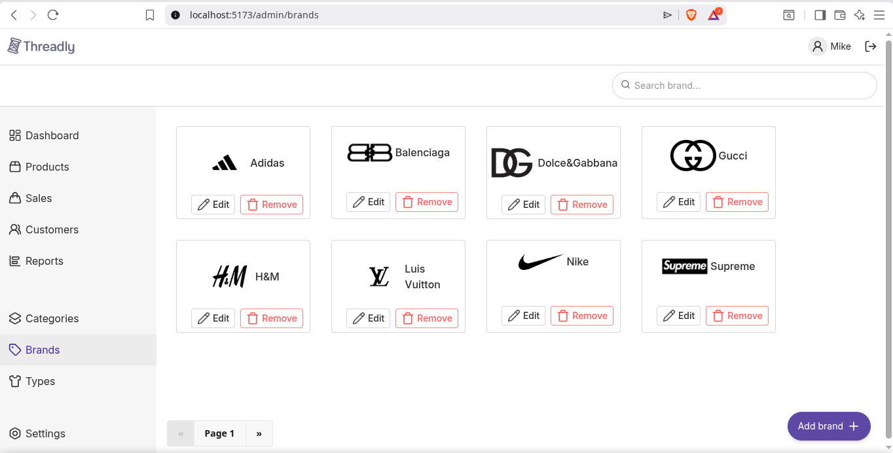
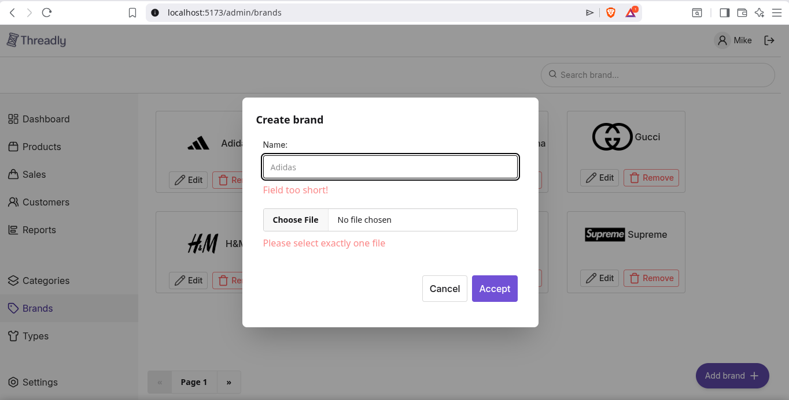
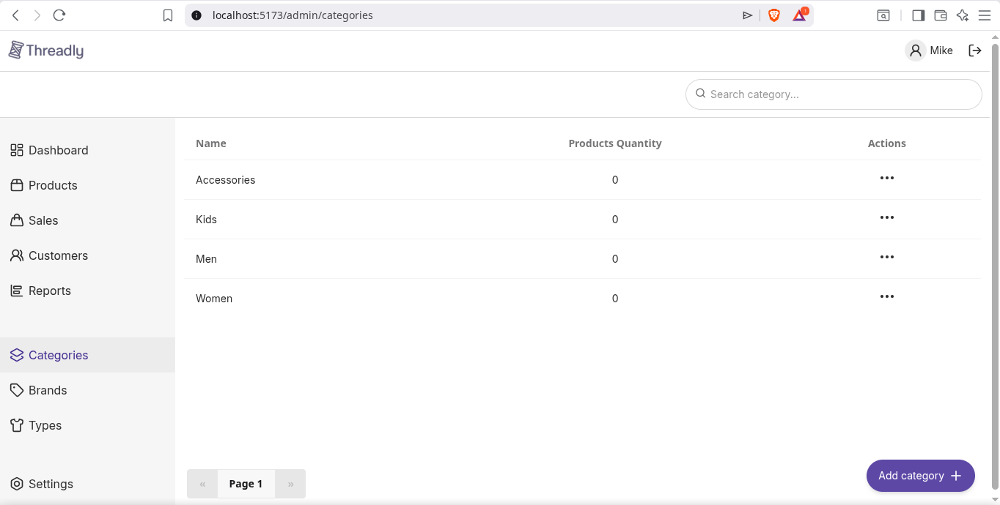

# Threadly

A modern clothing marketplace web application designed to provide users with a seamless and intuitive shopping experience. Threadly allows users to browse, filter, and discover fashion products efficiently while offering a clean and responsive interface.

## Features
- Product search functionality
- Product listing with advanced filtering system and pagination
- Multiple filters
- Dynamic results display
- Filter chips for active selections
- Add/remove products from favorites
- Shopping cart access
- User profile section with authentication controls
- Product ratings and reviews
- Fully responsive design

## Tech Stack
### Frontend
- React (Vite)
- TailwindCSS
- DaisyUI
- TanStack Query

### Backend
- NestJS
- Prisma ORM
  
## Getting Started
### Installation
```bash
# Clone the repository
git clone https://github.com/Alvarez-Bermudez/marketplace-threadly.git

# Navigate to project folder
cd marketplace-threadly
```

### Backend:
```bash
cd backend

#Install dependencies
pnpm install

#Run server
pnpm start:dev
```

### Frontend:
```bash
cd frontend

#Install dependencies
pnpm install

#Navigate to /frontend/src/api/client.ts and update BASE_URL with your backend hostname and port

#Run project
pnpm dev
```

## Design
Open the folder "design-Lunacy". This folder contains the design file. Open with Lunacy app

## Screenshots




## Contributing
Contributions are welcome! Feel free to fork the repository and submit a pull request with improvements or new features.